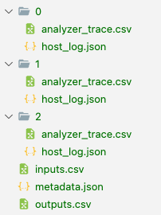

---
jupytext:
  text_representation:
    extension: .md
    format_name: myst
    format_version: 0.13
    jupytext_version: 1.16.0
kernelspec:
  display_name: Python 3
  language: python
  name: python3
---

# Data Logging
Labbench provides several data logging capabilities oriented toward experiments that involve complex sweeps or test conditions. Their general idea is to automatically log small details (device parameters, test conditions, git commit hashes, etc.) so that automation code is focused on the test procedure. The resulting logging system makes many implicit decisions but attempts describe the resulting structure clearly:
* Automatic logging of simple scalar parameters of {py:class}`labbench.Device` objects that are defined with {py:mod}`labbench.paramattr`
* Manual logging through simple dictionary mapping
* Consistent and automatic mapping from non-scalar types ({py:class}`pandas.DataFrame`, {py:func}`numpy.array`, long strings, files generated outside the data tree, etc.)
* Support for several output data types: {py:class}`labbench.CSVLogger` and {py:class}`labbench.SQLiteLogger`

## Example: Logging `Device` objects
To get started, consider a simple loop:

```{code-cell} ipython3
import numpy as np
import labbench as lb
from labbench.testing.pyvisa_sim import SpectrumAnalyzer, PowerSensor

lb.visa_default_resource_manager('@sim')
lb.show_messages('info')

sensor = PowerSensor()
analyzer = SpectrumAnalyzer()

db = lb.CSVLogger(path=f"./{np.random.bytes(8).hex()}")
db.observe_paramattr([sensor, analyzer])

with sensor, analyzer, db:
    for freq in (5.8e9, 5.85e9, 5.9e9):
        analyzer.center_frequency = freq
        sensor.frequency = freq

        sensor.trigger()
        analyzer.trigger()

        data = {
            'analyzer_trace': analyzer.fetch(),
            'sensor_reading': sensor.fetch()[0],
        }

        db.new_row(data)
```

### Output data structure
Experimental results are populated as follows in a directory at the given path:



The root table in `outputs.csv` gives the high level test conditions and results:

```{code-cell} ipython3
import pandas as pd

root = pd.read_csv(f'{db.path}/outputs.csv')
root
```

This points us at scalar test conditions and results, and paths to paths to files containing for non-scalar data (arrays, tables, etc.) and long text strings. Examples here include the measurement trace from the spectrum analyzer (column `'analyzer_trace.csv'`), and the host log JSON file (`'host_log'`). For example:

```{code-cell} ipython3
pd.read_csv(f"{db.path}/{root['analyzer_trace'][0]}")
```

```{code-cell} ipython3
import json

with open(f"{db.path}/metadata.json", 'r') as stream:
    metadata = json.load(stream)

# metadata['device_objects']
metadata['field_name_sources']
```

For a more systematic analysis to analyzing the data, we may want to expand the root table based on the relational data files in one of these columns. A shortcut for this is provided by {py:func}`labbench.read_relational`:

```{code-cell} ipython3
lb.read_relational(
    f'{db.path}/outputs.csv',

    # the column containing paths to relational data tables.
    # the returned table places a .
    'analyzer_trace',

    # copy fixed values of these column across as columns in each relational data table
    ['sensor_frequency', 'sensor_reading']
)
```

For each row in the root table, the expanded table is expanded with a copy of the contents of the relational data table in its file path ending in `'analyzer_trace.csv'`.

```{code-cell} ipython3
import labbench as lb
from labbench.testing.pyvisa_sim import SpectrumAnalyzer, PowerSensor, SignalGenerator
import numpy as np
from shutil import rmtree

FREQ_COUNT = 3
DUT_NAME = "DUT 63"
DATA_PATH = './data'


# the labbench.testing devices support simulated pyvisa operations
lb.visa_default_resource_manager('@sim')

class Testbed(lb.Rack):
    sensor: PowerSensor = PowerSensor()
    analyzer: SpectrumAnalyzer = SpectrumAnalyzer()
    db: lb.CSVLogger = lb.CSVLogger(path=DATA_PATH)

    def open(self):
        # remove prior data before we start
        self.db.observe_paramattr(self.analyzer)
        self.db.observe_paramattr(self.sensor, always=['sweep_aperture'])

    def single(self, frequency: float):
        self.analyzer.center_frequency = frequency
        self.sensor.frequency = frequency

        self.sensor.trigger()
        self.analyzer.trigger()

        return dict(
            analyzer_trace=self.analyzer.fetch(),
            sensor_reading=self.sensor.fetch()[0]
        )

rmtree(Testbed.db.path, True)

with Testbed() as rack:
    for freq in np.linspace(5.8e9, 5.9e9, FREQ_COUNT):
        rack.single(freq)

        # this could also go in single()
        rack.db.new_row(
            comments='try 1.21 GW for time-travel',
            dut = DUT_NAME,
        )
```
